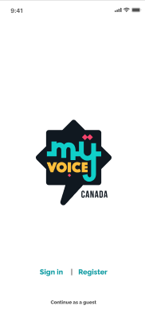
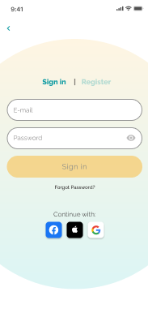
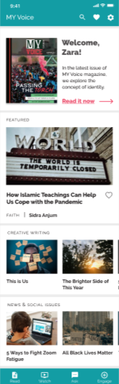

# MY Voice's Official App

Welcome to [MY Voice Canada's](https://www.myvoicecanada.com) official app! This _youth-made_ app allows you to read **articles from our magazine**, **ask questions that can be answered by professional youth councilors**, **connect with other Muslim adolescents nearby**, and much more!!! The rest of this document outlines the app and its technicalities, and contains some information about the team behind it...

## App Layout & Screenshots

Here are a couple pages of the app in image format:

### Splash Screen

### Sign in

### Homepage

## Technicalities

This app was made in Dart using the Flutter SDK (ver. >=2.12.0). At the moment, however, it is only tailored to Android devices, though we do plan on releasing a proper iOS version soon.

The entire list of dependencies is defined in `pubspec.yaml`. Some main dependencies include...

- firebase_auth (ver. 3.3.4)
- cloud_firestore (ver. 3.1.5)
- provider (ver. 6.0.0)
- hexcolor (ver. 2.0.5)
- flutter_spinkit (ver. 5.1.0)
- flutter_phoenix (ver. 1.0.0)

## The Team

As aforementioned, this app was fully **thought of**, **designed**, and **developed** by youth from [MY Voice Canada](https://www.myvoicecanada.com), with just a touch of adult guidance. The following is a chart detailing the members of the team along with their roles and contact:

| Name             |            Role             |                     Contact |
| :--------------- | :-------------------------: | --------------------------: |
| Maida Amir       |       (ADULT) Advisor       |        maida.amir@gmail.com |
| Sabah Raja       | App Team Lead + UX Designer |      sabs.raja.93@gmail.com |
| Faizaan Aslam    |     Head App Developer      |       faizaan3424@gmail.com |
| Fatima Sarfraz   |      User & Usability       |     fatisarfraz31@gmail.com |
| Hana Sheikh      |      Graphic Designer       | hanasheikh.design@gmail.com |
| Ahmed Saleem     |      Graphic Designer       |    ahmed.a.saleem@gmail.com |
| Ibrahim Chaudhry |    Copy & Content Writer    |    ibrahim.c02443@gmail.com |

The link to the full MY Voice team can be found [here](https://myvoicecanada.com/about/).

<!--## Getting Started

This project is a starting point for a Flutter application.

A few resources to get you started if this is your first Flutter project:

- [Lab: Write your first Flutter app](https://flutter.dev/docs/get-started/codelab)
- [Cookbook: Useful Flutter samples](https://flutter.dev/docs/cookbook)

For help getting started with Flutter, view our
[online documentation](https://flutter.dev/docs), which offers tutorials,
samples, guidance on mobile development, and a full API reference.
-->
